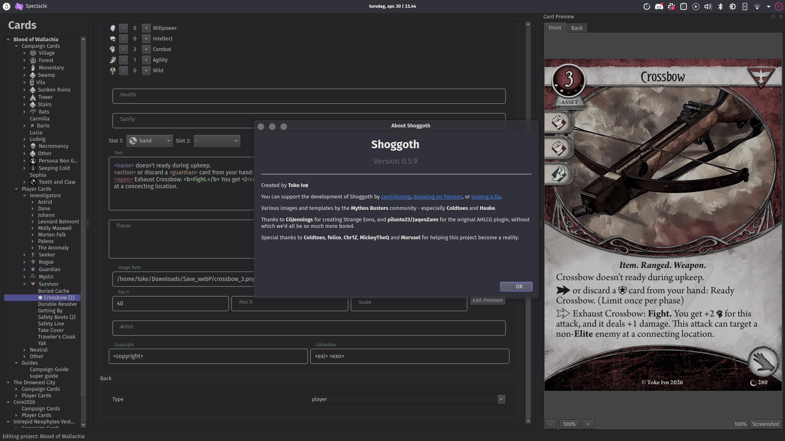
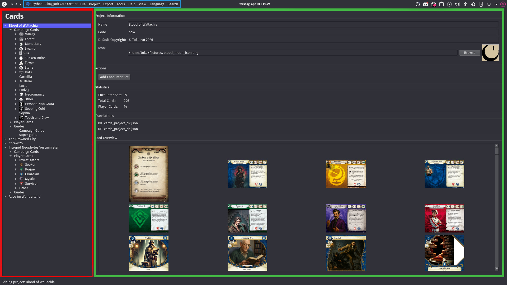
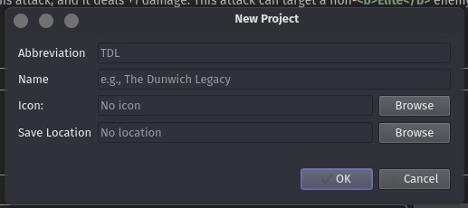

# Shoggoth Manual

---

## What is Shoggoth?

Shoggoth is a desktop application for creating custom cards and related content for **Arkham Horror: The Card Game** by Fantasy Flight Games.

Shoggoth is not affiliated with, nor endorsed by Fantasy Flight Games.

---

## Table of Contents

- [What is Shoggoth?](#what-is-shoggoth)
- [Installation](#installation)
- [General Concepts](#general-concepts)
- [The User Interface](#the-user-interface)
  - [The Project Tree](#the-project-tree)
  - [The Editing Area](#the-editing-area)
  - [The Card Preview](#the-card-preview)
  - [The Command Palette](#the-command-palette)
- [Creating a Project](#creating-a-project)
- [Player Cards](#player-cards)
  - [Asset](#asset)
  - [Event](#event)
  - [Skill](#skill)
  - [Investigator](#investigator)
  - [Customizable](#customizable)
- [Scenario Cards](#scenario-cards)
  - [Enemy](#enemy)
  - [Treachery](#treachery)
  - [Location](#location)
  - [Act & Agenda](#act--agenda)
  - [Story](#story)
  - [Chaos Bag Reference Card](#chaos-bag-reference-card)
- [Writing Card Text](#writing-card-text)
- [Working with Images](#working-with-images)
- [Guides](#guides)
- [Exporting Your Cards](#exporting-your-cards)
- [Translating a Project](#translating-a-project)
- [Keyboard Shortcuts](#keyboard-shortcuts)
- [File Organization and Sharing](#file-organization-and-sharing)
- [Advanced: Editing JSON Directly](advanced-json.md)

---



---

## Installation

For Windows and Mac: Download the latest release for your platform from the [releases page](https://github.com/tokeeto/shoggoth/releases). No installation is required — just extract and run the executable.

For linux: Install Shoggoth via python. `pip install shoggoth`. It's recommended to use `pipx shoggoth` (or `uvx shoggoth`) to install Shoggoth in it's own isolated environment. You can also request linux standalone binaries if you want them. So far, no one has had a need of those though.

### Building from Source

If you want to build Shoggoth yourself or contribute to development:

1. Install [uv](https://docs.astral.sh/uv/)
2. Clone this repository
3. Run `uv run shoggoth`

Shoggoth downloads its asset pack (card templates, fonts, icons) automatically on first launch from the [shoggoth-assets](https://github.com/tokeeto/shoggoth_assets) repository. You only need to clone that repo if you want to modify the assets themselves. Shoggoth will stop managing that repo/folder as soon as it sees a .git folder, so make sure to delete .git if you want to go back to Shoggoth automatically downloading updates again.

---

## General Concepts

Shoggoth organizes content the same way Arkham Horror products are structured:

| Concept | What it means |
|---|---|
| **Project** | An "expansion" — a campaign box, investigator pack, or any product containing a collection of cards. Stored as a single `.json` file. |
| **Encounter Set** | A named group of encounter cards sharing an icon and sequential numbering. |
| **Card** | A single card with a front and a back **Face**. |
| **Face** | One side of a card. Each face must have a **type** that determines its default template and layout. |
| **Type** | A set of default values for a face (images, fields, layout). Built-in types include `investigator`, `asset`, `location`, `enemy`, etc. Types can also point to custom templates. On a technical level, a Type is just a `.json` file describing the default values of a card. |

Because everything is just a card with typed faces, Shoggoth doesn't enforce rigid categories. You can always override any field or point to a custom template to create something entirely unique.

---

## The User Interface

Shoggoth's window is divided into three areas:



1. **Menu bar** — access all commands
2. **Project Tree** (left panel) — navigate cards and encounter sets
3. **Editing area** (right) — edit the selected card or project element

You can toggle the Project Tree with **Ctrl+K** and the card preview panel from **View → Show Preview**.

### The Project Tree

The tree shows your entire project hierarchy. Player cards are grouped by class (Guardian, Seeker, etc.). Encounter cards are grouped by encounter set.

- **Click** an item to open its editor.
- **Right-click** any item to see context-specific actions (rename, duplicate, delete, add child, etc.).
- **Drag and drop** cards to move them between encounter sets or class groups. This will generally attempt to do what you intend where possible.

The tree has two display modes switchable from the View menu:
- **Tree view** — hierarchical, showing encounter sets as folders.
- **List view** — flat list of all cards, sortable by name or collection number.

### The Editing Area

Most items in the tree open a dedicated editor when selected:

- **Project editor** — project-wide settings, encounter sets, and guides
- **Card editor** — tabbed front/back editing for a single card
- **Encounter set editor** — thumbnail grid of all cards in a set
- **Guide editor** — Markdown-based rulebook editor (see [Guides](#guides))
- **Translation editor** — field-by-field translation overlay (see [Translations](#translating-a-project))

### The Card Preview

Enable the preview panel from **View → Show Preview**. The preview renders the card as it will look when exported. Click the front/back tabs to switch between front and back faces. The bleed area of the card (if shown) will be marked in red. This is the part of the card that is not meant to printed or seen, but acts as a safety margin when getting cards printed professionally.

### The Command Palette

Press **Ctrl+P** to open the command palette. It lists every menu action and most settings toggles, searchable by name. This is the fastest way to reach any command without remembering where it lives in the menus.

---

## Creating a Project

**File → New Project** (or **File → Open Project** to open an existing one).

When creating a new project, you'll set:

- **Name** — used for display and as the default export filename
- **Save location** — the project `.json` file will be created here; all relative image paths are resolved from this folder. It can generally be a good idea to create a new folder for each project.
- **Encounter set icon** — an image used for the default encounter set (you can change it later).

After creation, the project editor opens. From here you can rename encounter sets, add new ones, add guides, or jump straight to creating cards.



### Project Templates

**Project → Add Scenario**, **Add Campaign**, **Add Investigator**, or **Add Investigator Expansion** pre-populate your project with the right encounter sets and card skeletons for that format, so you don't have to set them up from scratch.

- **Add Scenario** — Adds a new encounter set with 3 enemies, 7 treacheries, a bunch of locations and some acts and agendas. This split mirrors an average scenario.
- **Add Campaign** — Adds 8 scenarios.
- **Add Investigator** — Adds a new investigator card, an asset card and a treachery weakness card, all linked to the chosen investigator name.
- **Add Investigator Expansion** — Adds a whole set of player cards matching the average distribution of cards in an official player expansion: A bunch of level 0 cards, some upgrades, in each class, with a split between assets, events and a few skills.

---

## Player Cards

Create a new player card via **File → New Card** (**Ctrl+N**) or by right-clicking in the Project Tree and selecting **New Card**.

In the New Card dialog, choose:

- **Template** — the card face type (see below)
- **Name** — the card's name
- **Encounter set** — Should be set to player card. If you pick an encounter set, you're now creating a story card.

Player cards live under the class-grouped section of the Project Tree (Guardian, Seeker, Rogue, Mystic, Survivor, Multi or Other).

### Asset

Assets are the most common player card type: Weapons, Tomes, Allies, and other Items you put into play.

**Front fields:**
- Name, subtitle
- Class(es)
- Cost
- Level (0–5, None or customizable)
- Traits
- Slots
- Willpower / Intellect / Combat / Agility skill icons
- Body text
- Flavor text
- Health / Sanity
- Illustration

All text fields support the same [formatting](text-formatting.md).

**Back:** Generic player card back by default; customizable.

### Event

One-use cards that are played and discarded.

**Front fields:** Same as Asset minus slot and health/sanity.

### Skill

Skill cards committed to skill tests.

**Front fields:**
- Name, subtitle
- Class(es)
- Level
- Traits
- Skill icons
- Body text
- Flavor text
- Illustration

### Investigator

A full two-sided investigator card.

**Front fields:**
- Name, subtitle
- Class(es)
- Willpower / Intellect / Combat / Agility stats
- Health / Sanity
- Traits
- Illustration

**Back fields:**
- Class(es)
- Deck-building restrictions
- Deckbuilding options and requirements
- Flavor text

### Customizable

Customizable cards have upgrade boxes on the front.

The **Customizable** editor adds an upgrade table where each row has a checkbox count, name and upgrade text. The **Customizable Back** type is a purpple version of the player card back.

---

## Scenario Cards

Scenario cards follow the same **File → New Card** / right-click flow. They're added to Encounter Sets.

### Enemy

**Fields:** Fight, Health, Evade, damage, horror, class (eg. weakness), traits, body text, victory points, flavor text, illustration.

### Treachery

**Fields:** Class, traits, text, flavor text, illustration.

### Location

Locations have a **front** (the revealed side) and a **back** (the unrevealed side). They have the same properties and the same UI, but different templates. Also, the back has a default value of "\<copy\>" for a lot of its fields, meaning it will take on the value of the front unless changed.

**Fields:** Clues, shroud, connection icon, connections, traits, text, victory points, flavor text, illustration.

The location view (**View → Location View**) arranges all locations in your project on a canvas so you can check connection layouts visually. You can also use this to create a location overview map for your campaign guide, as well as right-drag new connections between locations. You can press **F** or **Shift+F** to flip a single/all cards respectively, to see the other side (which may change connections).

### Act & Agenda

Acts and Agendas have matching front and back types (`act` / `act_back`, `agenda` / `agenda_back`).

**Front:** Act/Agenda index (e.g. "1a"), title, body text, flavor text, doom/clue threshold.
**Back:** Act/Agenda index (e.g. "1b"), title, body text, resolution text.

### Story

A rather generic card face for writing story or instructions for the players. Usually put on the back of story critical locations or enemies. Features a single text field.

### Chaos

Also known as a Scenario Reference card.

Shows effect of each symbol token in the current scenario. You can combine multiple tokens into one effect with a comma (eg. "cultist, tablet").

---

## Writing Card Text

Shoggoth uses a lightweight tag syntax for card body text. Tags are rendered directly in the card preview as you type.

For a full reference of every tag, see **[Text Formatting Reference](text-formatting.md)** or open **Help → Text Options** inside Shoggoth.

**Quick reference:**

| Tag | Effect |
|---|---|
| `<b>...</b>` | Bold, Action type |
| `<i>...</i>` | Italic, flavor text |
| `<t>...</t>` | Trait |
| `<action>` | Action symbol |
| `<free>` | Fast trigger symbol |
| `<reaction>` | Reaction symbol |
| `<skull>`, `<cultist>`, `<tablet>`, `<elder_thing>` | Chaos token icons |
| `<elder_sign>`, `<auto_fail>` | Special chaos token icons |
| `<willpower>`, `<intellect>`, `<combat>`, `<agility>` | Stat icons |
| `<for>` | Expands to **Forced –** |
| `<rev>` | Expands to **Revelation –** |
| `<prey>` | Expands to **Prey –** |
| `<br>` | Line break |
| `--` | En dash (–) |
| `---` | Em dash (—) |

---

## Working with Images

Every Face has an **Illustration** field that accepts a file path to an image. Paths can be:

- **Absolute** — points to a specific file anywhere on your system
- **Relative** — resolved from the project's `.json` file location (recommended for portability)

Supported formats: JPEG, PNG, WebP, and most other common image formats.

### Gather Images

**File → Gather Images** copies all referenced images into a subfolder next to the project file.

**File → Gather and Update Images** does the same but also updates the entire project to use these new files. Use this if you want to make it easier to share your project with someone else.

---

## Guides

Scenario or Campaign guides is a Markdown-formatted document attached to your project.

**Project → Add Guide** opens the guide creation dialog.

The guide editor provides:
- A Markdown editor with syntax highlighting.
- A section list for organizing content.
- A PDF viewer to preview your work.

While I'm trying to keep things consistent between cards and the campaign guide, it is, at its core, two very different rendering systems.

There's a lot of nifty things you can do in the campaign though, such as link to card attributes so if you later change the name of a card, the campaign guide will automatically update, or reference the layout of a scenario automatically and generate setup instructions based on the links between encounter sets.

---

## Exporting Your Cards

Shoggoth offers several export paths. See **[Exporting Reference](exporting.md)** for full details.

**Quick export (Ctrl+E)** — saves the current card's front and back as images to the project folder immediately, no dialog.

**Export → Export to Images (Ctrl+Shift+E)** — batch export with control over:
- Scope (all cards, player cards only, or campaign cards only)
- File format (PNG / JPEG / WebP) and quality
- Image size (print, screen, or thumbnail)
- Filename format
- Optional card backs and bleed border

**Export → Export to PDF** — generates a print-ready PDF via the PrinceXML renderer. Also supports certain specific formats required by print shops.

**Export → Export to TTS** — generates a Tabletop Simulator deck JSON with card images ready to import into Tabletop Simulator. This export can also make a running instance of TTS update its cards immediately on export, updating all cards where they are. The export is local only, so for publication you'll still need to upload your images somewhere.

**Export → Export to arkham.build** — generates a JSON file compatible with the arkham.build deckbuilder, with an optional image URL pattern so your hosted images load automatically.

---

## Translating a Project

Shoggoth supports layered translations: the original text is never modified; translated text is stored in a separate overlay file.

This makes it easy to make translations of Shoggoth projects, without having to reconstruct the entire project in hand. Illustrations, set numbers, etc. always stay the same, only the text can be changed. This makes a translation dependent on the project file, but it also makes it possible to make a translation without needing anything but the project .json file. (No images needed, since the original author, or project owner, can export the translation easily afterwards)

1. **Project → Add Translation** — creates a new translation (set language and file path).
2. Select any card in the tree — the editor will show both original and translated fields side by side.
3. Type into the translated fields.
4. **Project → Load Translation** — load an existing translation file created by someone else.

When exporting with a translation active, the exported images use the translated text.

See **[Translation Guide](translations.md)** for details on sharing and managing translation files.

---

## Keyboard Shortcuts

| Shortcut | Action |
|---|---|
| `Ctrl+O` | Open project |
| `Ctrl+S` | Save |
| `Ctrl+N` | New card |
| `Ctrl+R` | Go to card (search by name) |
| `Ctrl+M` | Auto-enumerate cards |
| `Ctrl+E` | Quick export current card |
| `Ctrl+Shift+E` | Export images dialog |
| `Ctrl+P` | Command palette |
| `Ctrl+K` | Toggle project tree |

---

## File Organization and Sharing

A Shoggoth project is a single `.json` file. Card images are referenced by path — they're not embedded in the project file.

**Recommended layout for a shareable project:**

```
My Campaign/
  My Campaign.json        ← project file
  My Campaign images/     ← created by File → Gather Images
    art_location_1.jpg
    art_enemy_boss.png
    ...
  export of My Campaign/  ← created by Export
    card1_front.png
    card1_back.png
```

After running **Gather Images**, all paths in the project file are relative, so the entire folder can be zipped and shared. Recipients open `My Campaign.json` in Shoggoth directly.

### Working with a Text Editor

The `.json` format is designed to be human-readable and hand-editable. You can open the project file in any text editor to make bulk changes (find-and-replace, batch field updates, etc.).

For an explanation of the JSON schema, see **[Advanced: Editing JSON Directly](advanced-json.md)**.
