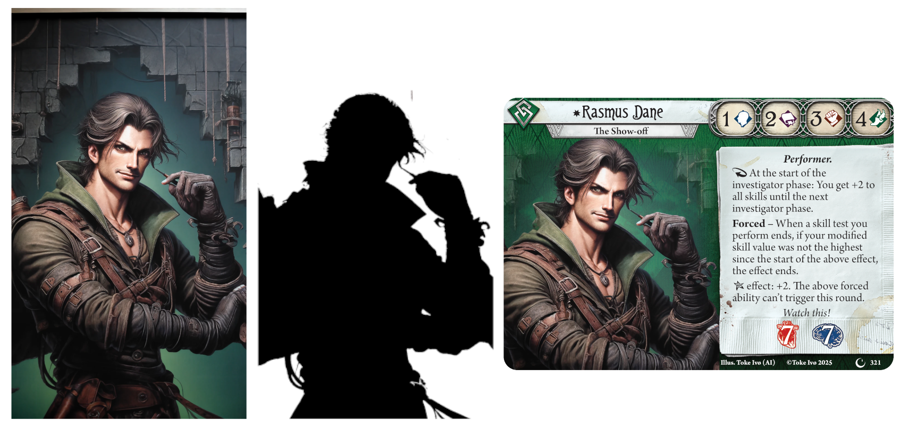

# Adding art

[← Back to the manual](manual.md)

## Adding an illustration

Every side that has art has an **Illustration** section. Click **Browse** and pick an image, or paste a file path.

Shoggoth reads PNG, JPEG, WebP, SVG and **PDF** files. A PDF is drawn at whatever size the card needs, so vector art stays sharp at any print size.

Fill in **Artist** to credit the illustrator on the card.

> **Paths and portability.** **Browse** stores the full path to the image, which only works on your computer. That's fine while you work. Before you move the project or send it to someone, run **File → Gather images and update**. It copies every image into a folder next to the project and switches the cards to *relative* paths, which work anywhere. You can also type a relative path yourself, like `art/lurker.png`, which Shoggoth looks up next to the project file. See [Sharing your project](sharing.md).

## Framing the art

By default, Shoggoth scales the image to fill the art area and centers it. To frame it yourself:

- **Click the small image** in the illustration section to unlock it, then **drag** to move the art and **scroll** to zoom. **Double-click** to go back to the automatic fit.
- Or type exact values into **Pan X**, **Pan Y** and **Scale**. Leave them empty for the automatic fit.
- **Mirror** flips the image horizontally.

Keep **Scale** at 1.0 or below where you can. Above 1.0, the image is being enlarged beyond its real resolution and will look soft in print. Shoggoth warns you when that happens. Official cards are about 1500×2100 pixels, so aim for art at least as large as the art area at that size.

When you change the image file in another program and save it, Shoggoth notices and redraws the preview immediately.

## Art that breaks the frame (investigators)

Investigator fronts have a few extra options that let the character stand out from the background, like on newer official investigators:

- **Shape Image**: a mask image with the same dimensions as your illustration: black where the character (the subject) is, and white or transparent elsewhere. Shoggoth uses it to separate the character from the background.
- **Allow shape to break boundary**: lets the character extend past the edge of the art area and over the card frame.
- **Shape fade**: *Flat* or *Distance* controls how the background fades out around the character.
- **Apply mask**: *Shaped* uses your shape image, *Simple* uses a standard soft-edged mask, and *None* shows the illustration as-is.
- **Apply class icon**: draws the investigator's class symbol large in the background, behind the character.



From left to right: the illustration, its shape image, and the resulting card. The shape image is a plain silhouette of the character, in black on white, at the same size as the illustration. On the card, the background fades into the frame while the character stays solid and overlaps the text box.

## Faded edges

**Tools → Fade edge of image** takes any image and fades its edges to transparent, either smoothly or with a rough, painted brush style. It saves the result as a new file. Use it for art that should blend into a card or a campaign guide page instead of ending in a hard edge.

## Images in card text

You can place small images inside card text, such as a custom icon or a symbol from another game:

```
Place 1 <image src="icons/key.png"> on this location.
```

The image is scaled to the height of the text. See [Advanced text](advanced-text.md#images-in-text) for details.

---

Next: **[Finding your way in a big project →](organizing.md)**
