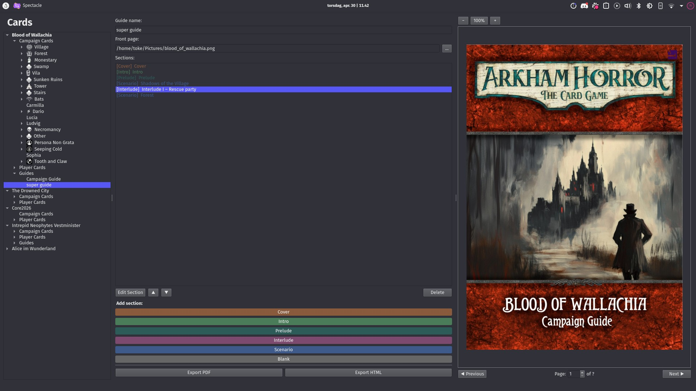

# Writing a campaign guide

[← Back to the manual](manual.md)

A campaign needs more than cards: an introduction, scenario setups, resolutions and interludes. Shoggoth's **guide editor** writes and lays out a campaign guide in the official style, right next to your cards, and keeps card names and scenario lists in sync with the project.



## Creating a guide

Choose **Project → Add Guide** and give it a name. The guide shows up under *Guides* in the tree. A project can have several guides, such as a campaign guide and a rules insert.

At the top of the guide editor:

- **Paper format**: A4, US Letter, or 7.5 × 9.5 in (the size of official campaign guides).
- **Chapter**: the visual style of the pages, *Chapter 1* or *Chapter 2*.
- **Front page**: an image for the cover.

## Sections

A guide is a list of **sections**, each a chunk of pages with its own look. Add them from **Add section**:

| Section | Used for |
|---|---|
| Cover | The title page |
| Intro | Campaign introduction, contents, and rules for the campaign |
| Prelude / Interlude | Story between scenarios |
| Scenario | A scenario's intro, setup and resolutions. It can be **linked to an encounter set**. |
| Blank | Anything else |

Double-click a section, or select it and click **Edit Section**, to write it. New sections start with example text in the right structure, so replace it as you go.

## Writing

Sections are written in **Markdown**, a simple plain-text format:

| You type | You get |
|---|---|
| `# Title`, `## Heading` | Headings (**Ctrl+1** to **Ctrl+5**) |
| `**bold**`, `*italic*` | **bold**, *italic* (**Ctrl+B**, **Ctrl+I**) |
| `[[Cultist]]` | A trait (**Ctrl+T**) |
| `- item` | A bulleted list |
| `<skull>`, `<elder_sign>`... | The same icons as on cards |
| `[pagebreak]` | Start a new page |

The **preview** on the right shows the finished pages. Step through them with *Previous* and *Next*.

### Boxes and blocks

Special boxes are written as *blocks*: a line starting with `:::name`, the content, and a line with just `:::`. The **Insert** menu above the editor adds them for you.

```
:::story
*The fog rolls in from the river, thick as wool...*
:::
```

| Block | What it is |
|---|---|
| `:::story` | Indented story text (read-aloud text) |
| `:::resolution` | The boxed "DO NOT READ until end of scenario" section |
| `:::codex` | A rules box |
| `:::toc` | A generated table of contents |
| `:::center`, `:::right`, `:::indent` | Alignment |
| `:::image-top`, `:::image-bottom`, `:::image-column`, `:::image-block` | An image placed at the top or bottom of the page, in a column, or as a box. Put the image path inside. |
| `:::image-fade-top` (and `-bottom`, `-column`, `-block`) | The same, with softly faded edges. Optional width, height and alignment: `:::image-fade-top 100% 80mm topright` |
| `:::image-free top=20mm left=10mm width=50mm` | An image placed exactly where you say |

Blocks can be nested, for example `:::right` inside `:::story` for the author line of a quote.

## Text that keeps itself up to date

Instead of typing a card's name, *refer* to it, and the guide always shows the current name, even after you rename the card. Use the **Card…** and **Enc…** buttons above the editor to pick a card or encounter set and a property. They insert references like these:

| Reference | Shows |
|---|---|
| `[card:<id>:name]` | A card's name |
| `[card:<id>:front:victory]` | Any field on a card's front or back |
| `[encounter:<id>:name]` | An encounter set's name |
| `[encounter:<id>:icon]` | An encounter set's icon |
| `[encounter:<id>:number_of_locations]` | How many locations the set has |
| `[encounter:<id>:location_overview:0]` | A location map of the set (see below) |
| `[project:name]` | The project's name |
| `[project:number_of_scenarios]`, `[project:scenario_names]` | The number of scenarios and their names ("The Gathering, The Midnight Masks and The Devourer Below"). Scenarios are the encounter sets with an **Order** number. |

### Generated setup and location layout

In a **scenario section linked to an encounter set**, *Insert → Setup* writes a setup section for you. It covers gathering the set and its **Required Sets** (from the encounter set's *Meta* tab), with their icons, and putting the locations into play. *Insert → Location Layout* inserts the location map. Adjust the text afterwards as needed.

Location maps come from the [location view](locations.md): arrange the locations there and click **Export**, and the guide picks up the image.

## Exporting the guide

Click **Export PDF** or **Export HTML** in the guide editor, or add a **Guides** entry to an export setup (see [Exporting card images](exporting.md)). PDF export uses Prince, just like card PDFs (see [Printing your cards](printing.md)). Rendering a long guide can take a little while.

> **Tip:** use relative image paths (like `images/map.png`) in guides too, so they keep working when you share the project. In hand-written HTML inside a guide, wrap the path in braces, like ``, and Shoggoth resolves it relative to the project folder.

---

Next: **[Planning locations and maps →](locations.md)**
