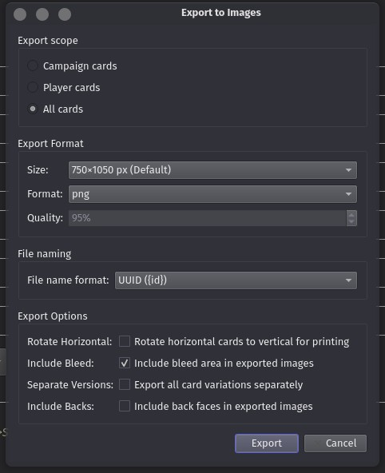
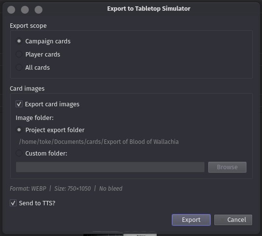

# Exporting Reference

Shoggoth provides several export formats depending on how you intend to use your cards.

---

## Quick Export (Ctrl+E)

**Export → Quick Export Current Card**

Instantly saves the front and back of the currently selected card as images to the project folder. No dialog, no options — good for a fast check or when you want one card quickly.

---

## Export to Images

**Export → Export to Images (Ctrl+Shift+E)**

Batch-exports cards as individual image files.



### Scope

Choose which cards to export:
- **All** — every card in the project
- **Player cards** — Guardian, Seeker, Rogue, Mystic, Survivor, and neutral player cards
- **Campaign cards** — encounter set cards (enemies, treacheries, locations, acts/agendas)

### Format

| Option | Details |
|---|---|
| **Size** | Print (standard), large, or thumbnail |
| **Format** | PNG (lossless), JPEG (fast), or WebP (lossless at 100%, typically smaller but slower to open than PNG) |
| **Quality** | Compression quality for JPEG and WebP (1–100%) |

For a quick experience, use 750x1050, jpeg at 95% quality.

Use the PNG at max size, with bleed enabled, when you want to send your project to a professional printing service.

### Filename Format

Controls how exported files are named. Options include card name, card index, or encounter set + index combinations. Choose a naming scheme that matches how your print service or playtest group expects files.

### Options

| Option | Effect |
|---|---|
| **Include backs** | Exports the back face of cards alongside the front. Without this, only a single copy of the player back and encounter back will be exported. |
| **Include bleed** | Adds a bleed border for print services that require it (recommended for printing) |
| **Rotate** | Ensures all cards are vertical. This is useful for printing layout. If you export for digital purposes, this should be disabled. |
| **Separate versions** | Exports each version of a multi-version card as a separate file. For instance, if your encounter set has 3 copies of Evil Monster (encounter number 3, 4 and 5), this will export one card with "3/7" one with "4/7", and one with "5/7". Without this option, onely one copy - "3-5/7" - will be exported. |

---

## Export to PDF

**Export → Export Card/Campaign/Player to PDF**

Generates a print-ready PDF. Requires PrinceXML. Shoggoth will prompt you to install it if it isn't found.

Use **Export → Install Prince** if you need to set it up.

### Scope

Choose to export a single card, all campaign cards, or all player cards.

### PDF Options

| Option | Details |
|---|---|
| **Image folder** | Where to render card images before assembling the PDF (next to project or custom path) |
| **Format** | PNG, JPEG, or WebP for the intermediate images |
| **Size** | Card image resolution |
| **Quality** | Compression for lossy formats |
| **Include backs** | Whether to include card backs in the PDF |
| **Output path** | Where to save the final PDF |

Once the image export is done, the pdf generation begins. This is handled by Prince and can take a good while for large projects. Shoggoth (and your system) might appear frozen while this runs. A full campaign can take upwards of 5 minutes at full print resoltion, and will generate a 4GB pdf file.

A full compaign at medium resolution, in jpeg format, will take a few seconds to run, and result in a 250MB pdf.

---

## Export to MBPrint PDF

**Export → Export Card/Campaign/Player to MBPrint PDF**

Same as PDF export but uses a fixed size and format optimized for uploading to MBPrint. Intermediate images are rendered at the exact resolution MPC expects.

---

## Export to Tabletop Simulator

**Export → Export to Tabletop Simulator**

Generates a TTS-compatible deck configuration.



### Scope

- **Campaign** — encounter set cards
- **Player** — player cards
- **All** — everything

### Images

By default Shoggoth renders and exports the card images alongside the TTS JSON. You can point the image folder to the project folder or a custom location.

If you uncheck **Export images**, the TTS JSON will reference images by id/path only (useful if you've already uploaded images somewhere and are just regenerating the deck data).

Shoggoth will write the deck JSON directly to TTS's `Saved Objects` folder if it can detect TTS on your system. Otherwise it will be saved to the project folder.

### Sync to TTS

With **Send to Tabletop Simulator** checked, Shoggoth will send the updated deck information directly to the running instance of TTS so it appears immediately in the game — no reload needed.

---

## Export to arkham.build

**Export → Export to arkham.build**

Generates a JSON file compatible with the [arkham.build](https://arkham.build) deckbuilder, allowing you to build decks with your custom cards.

For getting your custom content published, check with arkham.build itself.

### Image URL Pattern

If you host your card images somewhere publicly accessible (e.g. GitHub Pages, Dropbox, Imgur), enter the URL pattern here. Use `{filename}` as a placeholder for the image filename:

```
https://mysite.com/cards/{filename}
```

The generated JSON will reference the full URL for each card image.

If you leave this blank, the JSON will contain local image paths.

---

## Tips

- Run **File → Gather Images** before exporting to ensure all image paths are relative and portable.
- For print-on-demand services, use **Include bleed** in the image export settings. Most services require 3mm of bleed.
