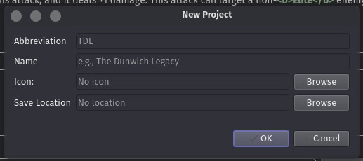

# Your first project

[← Back to the manual](manual.md)

Everything you make in Shoggoth lives in a **project**. A project is like an official product: a campaign box, an investigator expansion, a scenario pack, or just a pile of cards you're experimenting with.

## The building blocks

| | |
|---|---|
| **Project** | One product. Saved as a single `.json` file. |
| **Encounter set** | A group of encounter cards that share an icon and are numbered together, like "The Midnight Masks" or "Rats". |
| **Player cards** | Cards that aren't in an encounter set. Shoggoth groups them by class in the tree. |
| **Card** | A card with a **front** and a **back**. |
| **Guide** | A campaign guide or rules insert (see [Writing a campaign guide](campaign-guides.md)). |

Each side of a card has a **type** (asset, enemy, location, act, player card back...) which decides what it looks like and which fields the editor shows. The front and back are independent, so you can combine any front with any back.

## Creating a project

Choose **File → New Project**.

- **Abbreviation**: a short code for the project, like `TDL` for *The Dunwich Legacy*. It's used when naming exported files.
- **Name**: the project's full name.
- **Icon**: the project's collection icon. It's printed at the bottom of your cards next to the collection number. You can add or change it later.
- **Save location**: where to save the project file.

> **Tip:** give each project its own folder, and keep the art for that project in the same folder (or in a subfolder). Shoggoth finds images *relative to the project file*, so a self-contained folder can be moved, backed up or shared without breaking anything.

To open an existing project, use **File → Open Project** (**Ctrl+O**). You can have several projects open at once. They all show up in the tree, and Shoggoth reopens them the next time you start it.

Save with **Ctrl+S**. **File → Save Project As** (**Ctrl+Shift+S**) saves a copy under a new name.

## Project settings

Click the project's name at the top of the tree to open the project editor.

- **Name**, **Code** (the abbreviation) and **Icon**: as above.
- **Default Copyright**: printed in the small copyright line on every new card, for example `© Your Name 2026`.
- **Card Language**: the language for the words Shoggoth prints on cards by itself, like "ENEMY", "WEAKNESS" or "Revelation –". "Automatic" follows your Shoggoth language. Set this when you make cards in another language, so a German project says "GEGNER" instead of "ENEMY".
- **Hyphenation**: break long words across lines with a hyphen instead of shrinking the text.
- **French punctuation**: keep a word and a following `: ; ! ?` on the same line, as French typography requires.

The **Meta** tab holds information that isn't printed on the cards: author, description, tags and links. It's used when you publish your project.

At the bottom of the project editor you'll find statistics and a thumbnail overview of every card in the project.

## Adding encounter sets

Use **Project → New Encounter Set**, or right-click the project in the tree. Click an encounter set in the tree to edit it:

- **Name** and **Icon**. The icon is printed on every card in the set.
- **Code**: a short code used in some export file names.
- **Order**: the scenario number. Sets with an order count as *scenarios*. They're sorted first, they number their cards before the other sets, and the campaign guide lists them as the campaign's scenarios. Leave it empty for sets that aren't scenarios, like "Rats" or "Cultists".
- On the **Meta** tab, **Required Sets** lists the other encounter sets that are used together with this one. The Tabletop Simulator export uses it.

The **Cards** tab shows every card in the set as a thumbnail, along with counts of each card type and the traits in use.

## Getting a head start with templates

Instead of creating every card by hand, the **Project** menu can fill your project with placeholder cards in a typical layout. Rename and edit them afterwards, and delete what you don't need.

- **Add Scenario template**: a new encounter set with 3 acts, 3 agendas, 3 enemies and 7 treacheries (3 copies each), and 16 locations. That's roughly an average scenario.
- **Add Campaign template**: 8 scenarios like the above, already numbered 1–8.
- **Add Investigator template**: an investigator card with its back, a signature asset, a signature weakness, and a mini card. They're linked together, so the investigator's deckbuilding requirements already name the signature cards and update if you rename them.
- **Add Investigator Expansion template**: five investigators (one per class) plus about 120 player cards, split across classes, levels and card types the way an official investigator expansion is.

## Where Shoggoth puts things

In your project's folder, next to the project file, Shoggoth creates:

- `Export of <project name>/`: exported images, PDFs and so on (see [Exporting card images](exporting.md)).
- `<project name> images/`: art collected by **File → Gather images** (see [Sharing your project](sharing.md)).

---

Next: **[Making a card →](making-cards.md)**
