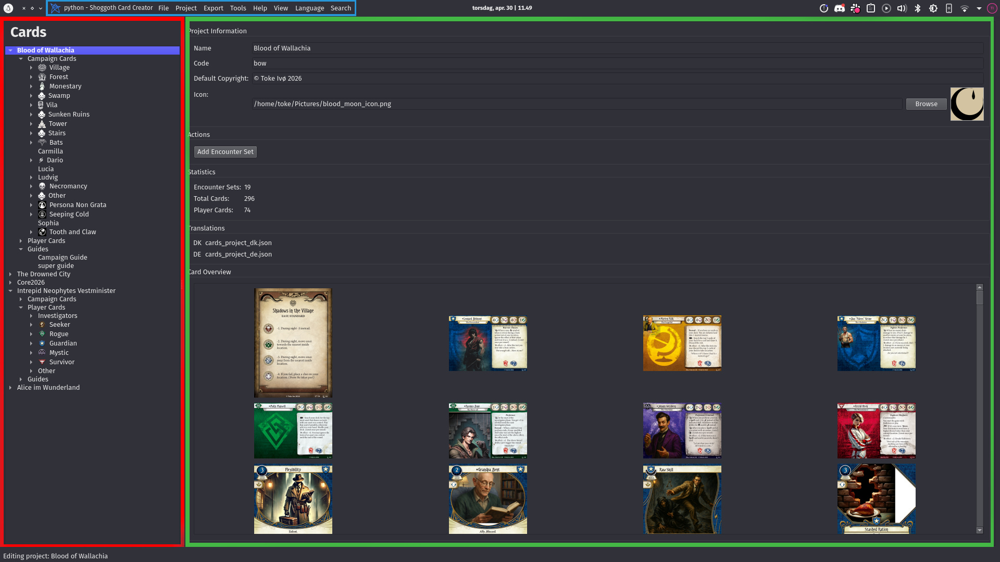

# Getting started

[← Back to the manual](manual.md)

## Installing Shoggoth

**Windows and macOS:** download the latest release for your system from the [releases page](https://github.com/tokeeto/shoggoth/releases/latest), extract it, and run it. You don't need to install anything else.

**Linux (or any system with Python):** install Shoggoth as a Python tool:

```
pipx install shoggoth
```

or, if you use uv, `uvx shoggoth`. Then start it with `shoggoth`.

> Windows Defender has occasionally flagged Shoggoth. Shoggoth isn't malware, but it downloads files (its asset pack) and opens files from your disk, which is the kind of thing virus scanners look for. As with any program, only open project files from people you trust.

## First launch

The first time you start Shoggoth, it downloads its **asset pack**: the card templates, icons, fonts and layout definitions it uses to draw cards. The download is around 750 MB, so give it a few minutes.

After that, Shoggoth checks for asset updates every time it starts and downloads only what changed. If you've edited any of those files yourself, Shoggoth asks before overwriting them. (To edit the asset pack on purpose, see [Making your own card types](custom-card-types.md#editing-the-asset-pack).)

Shoggoth also checks for new versions of itself when it starts. You can turn that off in **File → Settings → Updates**, or check manually with **Tools → Check for Updates**.

If the asset pack ever gets damaged, **Tools → Reset Asset Pack** downloads it again from scratch.

## A tour of the window



The window has three parts:

- **The project tree** (left) shows every open project. Encounter cards are grouped by encounter set, player cards by class, and guides are listed at the bottom. Click something to open it. Right-click it for everything you can do with it. Toggle the tree with **Ctrl+K**.
- **The editor** (middle) shows whatever you selected: a card, an encounter set, a guide, or the project itself.
- **The card preview** (right) shows the card exactly as it will be exported, and updates as you type. Turn it on and off with **View → Show Card Preview**.

The preview has a few handy toggles:

- **Trim: FFG / MTG** switches between the two common card sizes: the narrower official size (61.5×88 mm) and the wider size most print shops use (63.5×88 mm).
- **File → Settings → Display** can show the *bleed* (the extra margin that gets cut off when printing, drawn in red) and rounded corners, and can lower the preview resolution if previews feel slow.

## The command palette

Press **Ctrl+P** anywhere to open the **command palette**. Type part of a command's name, like "export", "new card" or "bleed", and press Enter. Every menu item is there, plus some settings toggles. If you don't know where something is, try this first.

## Settings

**File → Settings** holds your preferences:

| Tab | What's there |
|---|---|
| Display | Light/dark theme, preview resolution, bleed and rounded corners in the preview, and editor options like icon ligatures |
| Export | Default size, format and options for quick exports |
| External Applications | Prince (the PDF tool), and an optional CMYK color profile for print shops |
| Updates | Automatic update checks |
| Publishing | Signing in to the Library of Celaeno (see [Sharing your project](sharing.md)) |
| Privacy | Optional, anonymous usage statistics (off by default) |

Change the language of Shoggoth itself from the **Language** menu. The language printed *on your cards* is a separate, per-project setting (see [Your first project](first-project.md#project-settings)).

---

Next: **[Your first project →](first-project.md)**
