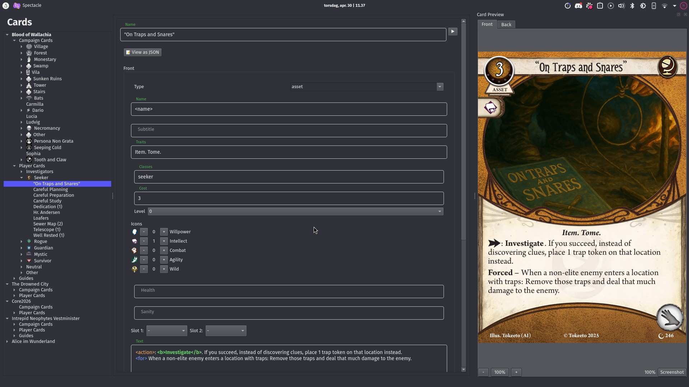

# Making a card

[← Back to the manual](manual.md)

## Creating a card

There are two ways to create a card:

- **File → New Card** (**Ctrl+N**) opens a dialog. Pick a **template** (the card type), type a **name**, and choose an **encounter set**. Choose *None (Player Card)* for player cards, or an encounter set for everything else, including story assets and weaknesses that come with a scenario.
- **Right-click in the tree**, which is usually faster. Right-clicking an encounter set's *Encounter* group offers *Add new enemy* and *Add new treachery*. Its *Locations* group offers *Add new location*, and its *Story* group offers acts, agendas and story cards. Right-clicking a class under *Player Cards* offers assets, events, skills and investigators.

The new card opens straight away. The template sets up both sides: an enemy gets the encounter card back, a location gets an unrevealed side, an act gets its "b" side, and so on.

## Filling in a card

The card editor has a tab for each side, **Front** and **Back**, plus **Meta** and **JSON** tabs that are covered below. The fields are the things printed on the card: name, traits, cost, skill icons, health, shroud and so on. Each card type only shows the fields that make sense for it. The preview updates as you type. When you move to another card, the editor stays on the tab you were last on, so you can go through the backs of several cards in a row; it starts on **Front** again the next time you open Shoggoth.

A few things are worth knowing:

- **The card name** is shared by both sides. A side's own *Name* field defaults to `<name>`, which means "the card's name". Replace it if one side needs a different title, like the two sides of an act or a location whose revealed side has a different name.
- **Unique**: the unique toggle next to the name puts the unique symbol in front of it.
- **Per investigator**: the toggle next to numbers such as clues, health or doom adds the per-investigator symbol.
- **Leave a field empty** to use the template's default. You rarely need to fill everything in.
- **Text fields** support formatting and icons, like `<b>Fight.</b>` or `<action>`. See [Writing card text](writing-text.md).
- **Additional text fields**, a folded section at the bottom of some sides, holds the copyright line and any extra text fields the card type has.

### Classes

The **Classes** row decides the card's color and frame.

- **Click** a class to choose it. **Shift-click** or **Ctrl-click** adds more classes, which makes a multi-class card.
- **Special ▾** has *Weakness*, *Basic Weakness*, *Specialist* and *Reward*. Encounter card types show *Weakness* and *Basic Weakness* as buttons directly.
- You can also type a **custom class** name. It's useful together with [your own card types](custom-card-types.md).

A weakness treachery or enemy is simply the normal treachery or enemy type with the *Weakness* or *Basic Weakness* class. The frame, the "WEAKNESS" label and the player card back follow automatically.

### Changing a side's type

Each side has a **type** selector at the top. Change it to turn a side into something else: make an enemy's back a location, or put a story text on the back of an agenda. Any front works with any back.

Some types come in several versions, such as full-art variants of most cards. They're listed in the same selector.

### Location backs: `<copy>`

The unrevealed side of a location starts with most fields set to `<copy>`, which means "the same as the other side". Change a field on the back only when it should differ, such as a different name, no clues, or a different connection symbol.

## Copies of a card

At the top of the card editor, under *Basic info*:

- **Amount in set**: how many copies of this card are in the encounter set. A treachery with 3 copies takes up three numbers in the set, so its encounter number reads `4-6`. See [Controlling card numbering](numbering.md).
- **Collection #** and **Encounter Set #** are filled in automatically by **Project → Enumerate all cards** (**Ctrl+M**). Run it whenever you've added, removed or reordered cards.
- **Investigator Link**: for signature cards and weaknesses, the name of the investigator they belong to. Linked cards are grouped with their investigator in exports and deck builders.

## Duplicating, copying and deleting

Right-click a card in the tree:

- **Duplicate** makes a copy right next to it. It's the quickest way to make a card that's similar to an existing one.
- **Copy**, followed by **Paste Card** on an encounter set or a player card group, copies it anywhere, including into another open project.
- **Delete** removes it. There's no undo, so save regularly.

You can select several cards at once with Shift-click or Ctrl-click, and copy, delete or transfer them together. You can also **drag** cards to another encounter set or class group.

## The Meta tab

Nothing on the **Meta** tab is printed on the card. It's for you, your collaborators, and the exporters.

- **Bonded to**: the card this one is bonded to, like a minion that another card's effect brings out. Bonded cards are sorted next to the card they belong to.
- **Set aside**: marks the card as not part of the starting setup.
- **Tags**: free-form labels for your own organization.
- **Folder**: where the card is listed in the sidebar's Folder View. It starts out as the card's default place, and you can type any folder path you like. See [Your own folders](organizing.md#your-own-folders).
- **Description** and **Notes**: design notes and comments to collaborators. They aren't exported.

## The JSON tab

Every card is stored as plain JSON, and the **JSON** tab lets you edit it directly. Changes apply as soon as the JSON is valid. It's handy for setting things the form doesn't have a field for, and for pasting a card someone sent you. See [Working with the project file directly](project-files.md).

---

Next: **[Writing card text →](writing-text.md)**
