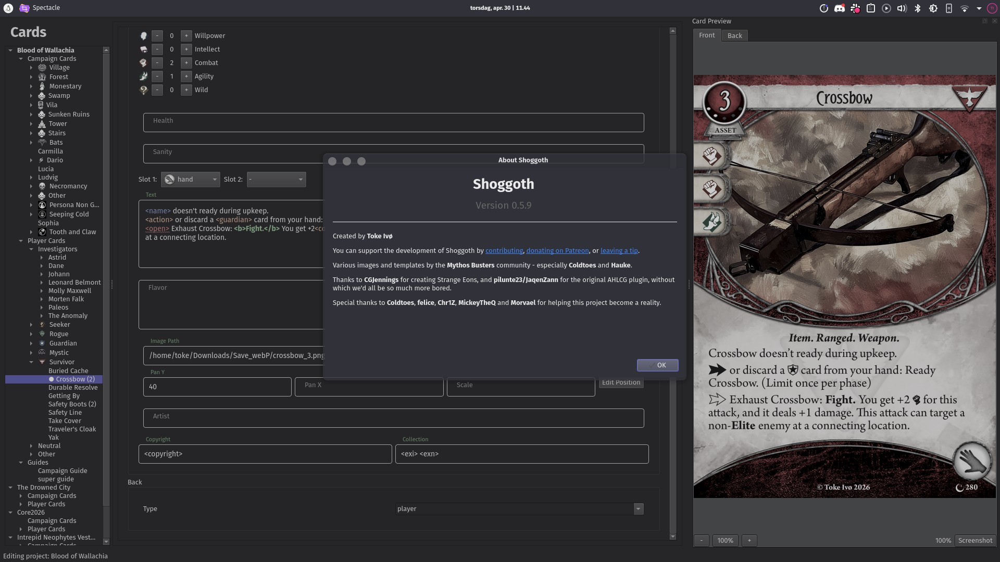

# The Shoggoth Manual

Shoggoth is a desktop app for making custom cards for **Arkham Horror: The Card Game**: single cards, investigators, player expansions, and full campaigns with encounter sets and campaign guides.

This manual is organized around **what you want to do**. It doesn't go through every card type. An asset has a cost, an enemy has fight and evade, and the editor shows you those fields. Each chapter here starts with a goal ("I want to print my cards") and walks you through the ways Shoggoth can get you there.

The chapters start simple and get more specialized. If you're new, read the first three in order. After that, go to whichever chapter matches what you're trying to do.

Shoggoth is not affiliated with, or endorsed by, Fantasy Flight Games.

---

## Getting started

1. **[Getting started](getting-started.md)**: install Shoggoth, first launch, and a tour of the window.
2. **[Your first project](first-project.md)**: create a project, set it up, and scaffold a scenario, campaign or investigator in one click.
3. **[Making a card](making-cards.md)**: create cards, fill them in, and handle copies, backs, classes and weaknesses.

## Everyday card making

4. **[Writing card text](writing-text.md)**: bold, traits, icons, keywords, flavor text, and the text editor's shortcuts.
5. **[Adding art](adding-art.md)**: illustrations, framing and zooming, art that breaks the frame, and faded edges.
6. **[Finding your way in a big project](organizing.md)**: search, jump to cards, and reorganize, move or copy cards between projects.

## Getting your cards out of Shoggoth

7. **[Exporting card images](exporting.md)**: quick exports, full-project exports, and saved export setups.
8. **[Printing your cards](printing.md)**: print at home, or order from a print shop (MBPrint, Azao and others).
9. **[Playing digitally](playing-digitally.md)**: Tabletop Simulator, live-syncing into a running game, and arkham.build.

## Campaigns, sharing and teamwork

10. **[Writing a campaign guide](campaign-guides.md)**: the campaign guide editor, and references that stay up to date.
11. **[Planning locations and maps](locations.md)**: the location view, connections, and location overviews for your guide.
12. **[Sharing your project](sharing.md)**: send a project to someone, work on it together in the cloud, and publish to the Library of Celaeno.
13. **[Translating a project](translating.md)**: translations and other modifications of someone else's project.

## Advanced

14. **[Advanced text: references, dynamic values and snippets](advanced-text.md)**: text that updates itself, typing whole sentences with a few keystrokes, and precise layout control.
15. **[Using your own fonts](fonts.md)**: use any font file, or any installed font, on your cards.
16. **[Controlling card numbering](numbering.md)**: collection numbers, encounter set numbers, and how to change them.
17. **[Making your own card types](custom-card-types.md)**: your own templates, layouts and fields.
18. **[Working with the project file directly](project-files.md)**: the JSON format, text-editor workflows, and command-line rendering.

## Reference

- **[Text tag reference](text-reference.md)**: every tag and icon you can use in card text.
- **[Keyboard shortcuts and command line](shortcuts.md)**

---

## Where to get help

- Inside Shoggoth, **Help → Text options** lists every text tag, and **View → Command Palette** (**Ctrl+P**) finds any command by name.
- Report bugs and request features on [GitHub](https://github.com/tokeeto/shoggoth/issues).
- You can support Shoggoth on [Patreon](https://patreon.com/tokeeto) or [Ko-Fi](https://ko-fi.com/tokeeto).
